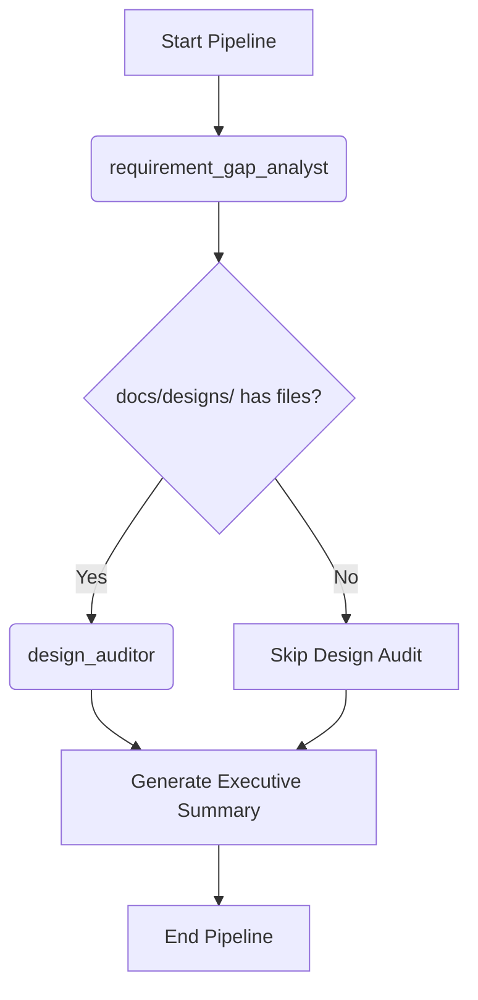

# Workflow: Requirement & Design Review

> **Controller**: `agents/master_orchestrator.md`

---

## Purpose
Audit requirement quality and design alignment at the earliest stage (Project Kick-off / Design Phase). Find logic gaps, ambiguities, and design mismatches before development begins.

## Execution Order

## Step 1: Requirement & Gap Analysis
- **Agent**: `agents/requirement_gap_analyst.md`
- **Output**: `reports/[Requirement_Name]_Req_Gap_Report.md` (dynamic naming)
- **Objective**: Detect internal logic defects (ambiguity, missing rules, contradictions) and cross-document traceability gaps.

## Step 2: UI/UX Design Audit
- **Agent**: `agents/design_auditor.md`
- **Output**: `reports/[Requirement_Name]_Design_Audit_Report.md` (dynamic naming)
- **Condition**: Only runs if `docs/designs/` is not empty.
- **Objective**: Verify design completeness against requirements — missing components, states, and flow mismatches.

## Step 3: Executive Summary
- **Agent**: `agents/master_orchestrator.md`
- **Output**: `reports/[Requirement_Name]_Executive_Summary.md` (dynamic naming)
- **Template**: `templates/executive_summary.md`
- **Objective**: Consolidate findings from Steps 1-2 into a Go/No-Go recommendation for development readiness.
