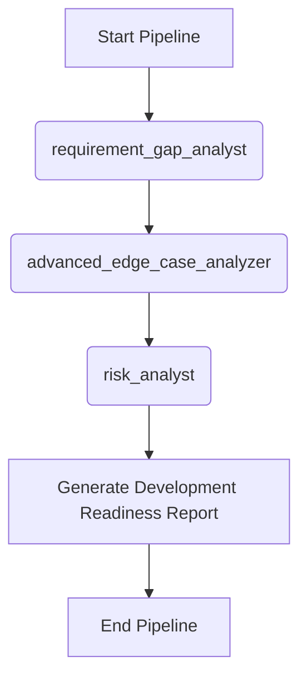

# Workflow: Shift-Left Risk Assessment

> **Controller**: `agents/master_orchestrator.md`

---

## Purpose
Phát hiện sớm các rủi ro, lỗ hổng yêu cầu ngay từ giai đoạn đầu (BA mới viết xong tài liệu) trước khi team Dev bắt đầu code. Nhằm mục đích Shift-Left quá trình đảm bảo chất lượng.

## Execution Order

## Step 1: Requirement & Gap Analysis
- **Agent**: `agents/requirement_gap_analyst.md`
- **Output**: `reports/requirement_gap_analysis.md`
- **Objective**: Tìm ra sự mâu thuẫn, thiếu sót logic trong các tài liệu requirement.

## Step 2: Edge Case Analysis
- **Agent**: `agents/advanced_edge_case_analyzer.md`
- **Output**: `reports/edge_case_report.md`
- **Objective**: Dò tìm các rủi ro, lỗi hóc búa, hành vi bất thường.

## Step 3: Risk Analysis
- **Agent**: `agents/risk_analyst.md`
- **Output**: `reports/risk_analysis.md`
- **Objective**: Đánh giá rủi ro (Security, Performance, Business) và đưa ra ma trận rủi ro.

## Step 4: Consolidation
- **Agent**: `agents/master_orchestrator.md`
- **Output**: Báo cáo tổng hợp Development Readiness.
