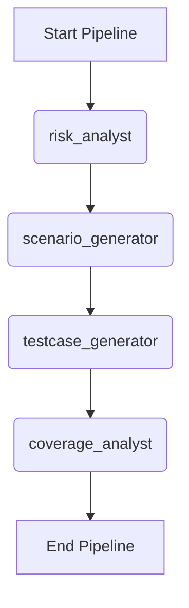

# Workflow: Full QA Test Engineering

> **Controller**: `agents/master_orchestrator.md`

---

## Purpose
Tự động hóa quá trình sinh kịch bản test từ mức high-level đến chi tiết, và cuối cùng là đo lường độ bao phủ (coverage) để đảm bảo không bỏ sót case nào.

## Execution Order

## Step 1: Risk Analysis (Optional but Recommended)
- **Agent**: `agents/risk_analyst.md`
- **Output**: `reports/[Requirement_Name]_Risk_Analysis_Report.md` (dynamic naming)
- **Objective**: Xác định các rủi ro để hỗ trợ sinh Test Scenarios toàn diện hơn.

## Step 2: Scenario Generation
- **Agent**: `agents/scenario_generator.md`
- **Output**: `reports/[Requirement_Name]_Test_Scenarios_Report.md` (dynamic naming)
- **Objective**: Phân tích Requirement (và Risk Analysis) để sinh ra các Kịch bản kiểm thử (Test Scenarios) cấp cao, bao gồm cả Edge Cases.

## Step 3: Test Case Generation
- **Agent**: `agents/testcase_generator.md`
- **Output**: `reports/[Requirement_Name]_Testcases.md`, `reports/[Requirement_Name]_Testcases.csv` (dynamic naming)
- **Objective**: Dựa trên các Scenarios ở trên, sinh ra các Test Cases chi tiết (gồm step-by-step, test data).

## Step 4: Coverage Analysis
- **Agent**: `agents/coverage_analyst.md`
- **Output**: `reports/[Requirement_Name]_Coverage_Report.md` (dynamic naming)
- **Objective**: Đối chiếu ngược các Test Cases vừa tạo với file Requirement gốc để đảm bảo độ bao phủ 100%.
