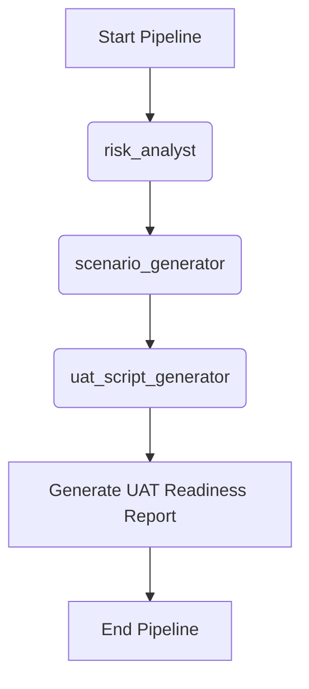

# Workflow: Business Acceptance (UAT Readiness)

> **Controller**: `agents/master_orchestrator.md`

---

## Purpose
Chuẩn bị kịch bản nghiệm thu (UAT) cho khách hàng hoặc business user, đồng thời đối chiếu với các rủi ro để đánh giá hệ thống đã sẵn sàng go-live chưa.

## Execution Order

## Step 1: Business Risk Assessment
- **Agent**: `agents/risk_analyst.md`
- **Output**: `reports/risk_analysis.md`
- **Objective**: Xác định các rủi ro kinh doanh cốt lõi để ưu tiên kịch bản kiểm thử.

## Step 2: Core Business Flow Extraction
- **Agent**: `agents/scenario_generator.md`
- **Output**: `reports/test_scenarios.md`
- **Objective**: Quét tài liệu để trích xuất toàn bộ luồng nghiệp vụ kinh doanh.

## Step 3: Risk-based UAT Script Generation
- **Agent**: `agents/uat_script_generator.md`
- **Output**: `reports/uat_scripts.md`
- **Objective**: Sinh ra các kịch bản UAT thân thiện với người dùng cuối, được tăng cường dựa trên đánh giá rủi ro (Risk-driven).
