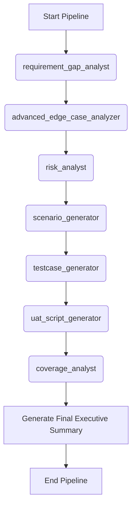

# Workflow: Comprehensive QA Pipeline (The Ultimate Pipeline)

> **Controller**: `agents/master_orchestrator.md`

---

## Purpose
Một pipeline chạy toàn bộ từ lúc nhận Requirement đến lúc sinh ra mọi tài liệu test và đo coverage. Hoàn hảo cho các chu kỳ kiểm thử hồi quy (Regression QA Cycle) lớn hoặc trước những Release quan trọng. Tận dụng tối đa input chéo giữa các Agent v3.0.0.

## Execution Order

## Step 1: Gap Analysis
- **Agent**: `agents/requirement_gap_analyst.md`
- **Output**: `reports/[Requirement_Name]_Req_Gap_Report.md` (dynamic naming)

## Step 2: Edge Case Discovery
- **Agent**: `agents/advanced_edge_case_analyzer.md`
- **Output**: `reports/[Requirement_Name]_Edge_Case_Report.md` (dynamic naming)
- **Dependency**: `docs/requirements/*`

## Step 3: Risk Analysis
- **Agent**: `agents/risk_analyst.md`
- **Output**: `reports/[Requirement_Name]_Risk_Analysis_Report.md` (dynamic naming)
- **Dependency**: Sử dụng thêm `reports/[Requirement_Name]_Edge_Case_Report.md` để đánh giá rủi ro sâu hơn.

## Step 4: Scenario Generation
- **Agent**: `agents/scenario_generator.md`
- **Output**: `reports/[Requirement_Name]_Test_Scenarios_Report.md` (dynamic naming)
- **Dependency**: Đọc cả `reports/[Requirement_Name]_Risk_Analysis_Report.md` và `reports/[Requirement_Name]_Edge_Case_Report.md` để sinh kịch bản bao phủ các ca khó.

## Step 5: Test Case Generation
- **Agent**: `agents/testcase_generator.md`
- **Output**: `reports/[Requirement_Name]_Testcases.md`, `reports/[Requirement_Name]_Testcases.csv` (dynamic naming)

## Step 6: UAT Script Generation
- **Agent**: `agents/uat_script_generator.md`
- **Output**: `reports/[Requirement_Name]_UAT_Scripts_Report.md` (dynamic naming)
- **Dependency**: Dùng `reports/[Requirement_Name]_Risk_Analysis_Report.md` và `reports/[Requirement_Name]_Test_Scenarios_Report.md` để sinh kịch bản UAT sát với rủi ro nghiệp vụ nhất.

## Step 7: Coverage Analysis
- **Agent**: `agents/coverage_analyst.md`
- **Output**: `reports/[Requirement_Name]_Coverage_Report.md` (dynamic naming)
- **Objective**: Chốt sổ độ bao phủ từ tất cả các file trên.

## Step 8: Consolidation
- **Agent**: `agents/master_orchestrator.md`
- **Output**: Báo cáo tổng hợp `reports/[Requirement_Name]_Executive_Summary.md` (dynamic naming).
