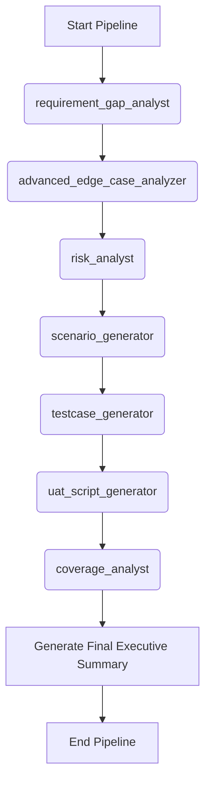

# Workflow: Comprehensive QA Pipeline (The Ultimate Pipeline)

> **Controller**: `agents/master_orchestrator.md`

---

## Purpose
Một pipeline chạy toàn bộ từ lúc nhận Requirement đến lúc sinh ra mọi tài liệu test và đo coverage. Hoàn hảo cho các chu kỳ kiểm thử hồi quy (Regression QA Cycle) lớn hoặc trước những Release quan trọng. Tận dụng tối đa input chéo giữa các Agent v3.0.0.

## Execution Order

## Step 1: Gap Analysis
- **Agent**: `agents/requirement_gap_analyst.md`
- **Output**: `reports/requirement_gap_analysis.md`

## Step 2: Edge Case Discovery
- **Agent**: `agents/advanced_edge_case_analyzer.md`
- **Output**: `reports/edge_case_report.md`
- **Dependency**: `docs/SRS.md`

## Step 3: Risk Analysis
- **Agent**: `agents/risk_analyst.md`
- **Output**: `reports/risk_analysis.md`
- **Dependency**: Sử dụng thêm `reports/edge_case_report.md` để đánh giá rủi ro sâu hơn.

## Step 4: Scenario Generation
- **Agent**: `agents/scenario_generator.md`
- **Output**: `reports/test_scenarios.md`
- **Dependency**: Đọc cả `reports/risk_analysis.md` và `reports/edge_case_report.md` để sinh kịch bản bao phủ các ca khó.

## Step 5: Test Case Generation
- **Agent**: `agents/testcase_generator.md`
- **Output**: `reports/testcases.md`

## Step 6: UAT Script Generation
- **Agent**: `agents/uat_script_generator.md`
- **Output**: `reports/uat_scripts.md`
- **Dependency**: Dùng `reports/risk_analysis.md` và `reports/test_scenarios.md` để sinh kịch bản UAT sát với rủi ro nghiệp vụ nhất.

## Step 7: Coverage Analysis
- **Agent**: `agents/coverage_analyst.md`
- **Output**: `reports/coverage_report.md`
- **Objective**: Chốt sổ độ bao phủ từ tất cả các file trên.
