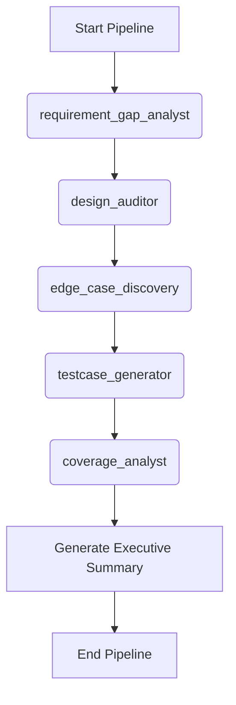

# Workflow: Core Pipeline

> **Controller**: `agents/master_orchestrator.md`

---

## Purpose
Define the single, sequential execution path for requirement processing, UI/UX audit, system risk analysis, and test generation.

## Execution Order

## Step 1: Requirement & Gap Analysis
- **Agent**: `agents/requirement_gap_analyst.md`
- **Output**: `reports/requirement_gap_analysis.md`

## Step 2: UI/UX Design Audit
- **Agent**: `agents/design_auditor.md`
- **Output**: `reports/design_audit.md`
- **Condition**: Only runs if `docs/design/` is not empty.

## Step 3: Edge Case Discovery
- **Agent**: `agents/edge_case_discovery.md`
- **Output**: `reports/edge_case_report.md`
- **Condition**: Runs on requirements to detect adversarial risks and race conditions.

## Step 4: Test Case Generation
- **Agent**: `agents/testcase_generator.md`
- **Output**: `reports/testcases.md`

## Step 5: Coverage Analysis
- **Agent**: `agents/coverage_analyst.md`
- **Output**: `reports/coverage_report.md`
